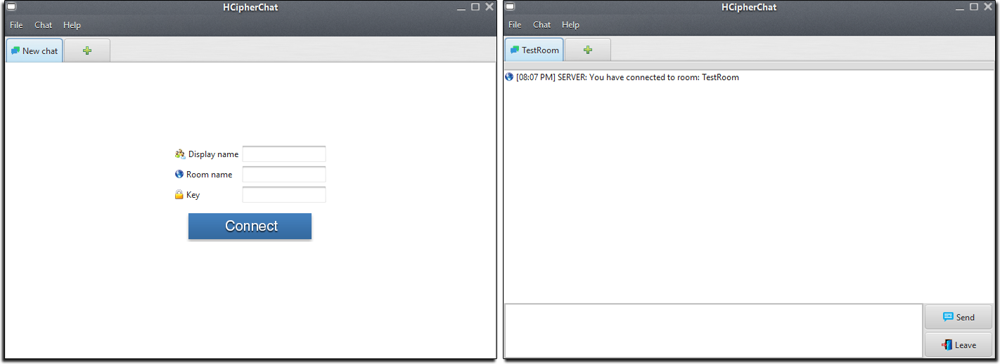
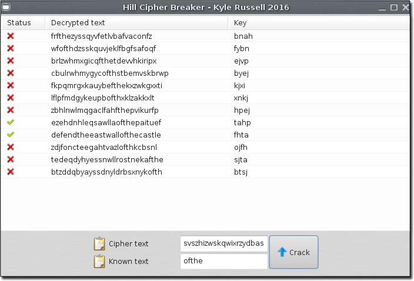

# HCipher Chat

HCipher Chat is an encrypted instant messaging desktop application  
Messages are encrypted & decrypted using the classical [Hill cipher](https://en.wikipedia.org/wiki/Hill_cipher)  
The chat application offers many features and the project also includes a hill cipher cracking tool  
See [Documentation](Documentation.pdf) for a user-guide and full write up of the methods used 

## Features
- Encrypted instant messaging
- Private and group sessions
- Join and chat in multiple rooms
- Cipher breaking tool

### Prerequisites
- JDK 1.8+
- Maven 3.3+
- [JSock Core](https://github.com/kyleruss/jsock-core)

### Installation
- [Download](https://github.com/kyleruss/hcipher-chat/releases/latest) the latest release
- Unzip the contents 
- Launch the server in `hillc-chat/hillc-chat-server/HCipherChatServer.exe`
- Launch the client in `hillc-chat/hillc-chat-client/HCipherChat.exe`

### Usage
- ##### Connecting to a room
Launch the HCipher Chat client  
You will be prompted to enter a display name which is the name that appears to other users,  
the room name which is the channel ID that other users can use to connect to your room and  
finally, the room key which is the private hill cipher key used to encrypt & decrypt messages in the room  
**Note:** You can join and be chatting in multiple rooms simultaneously, just click the `+` tab to join/create a new room

- ##### Chatting
Once you are connected to a chat room you can begin chatting  
Enter your message in the provided text box and click `Send`  
You can view the details of a message including the encrypted text by clicking on it  
If you wish to leave the room click `Leave`

## Hill-Cipher Breaker Tool
This project also includes a tool for cracking hill ciphers  
You can view this tool in the `hillc-breaker` directory  

Enter the cipher text of the hill-cipher you wish to crack  
Enter some known plain text and then click `Crack`  
You will be presented with a list of possible combinations and those  
that include the known plain text will be tick marked

### License
HCipher Chat is available under the MIT License  
See [LICENSE](LICENSE) for more details
